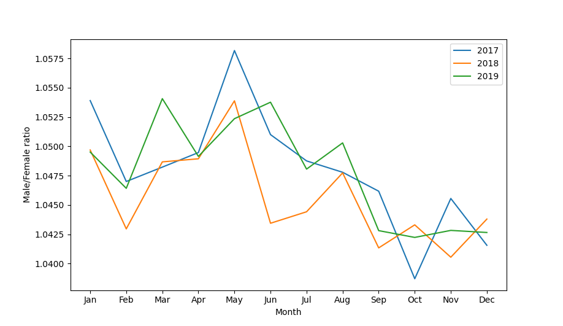
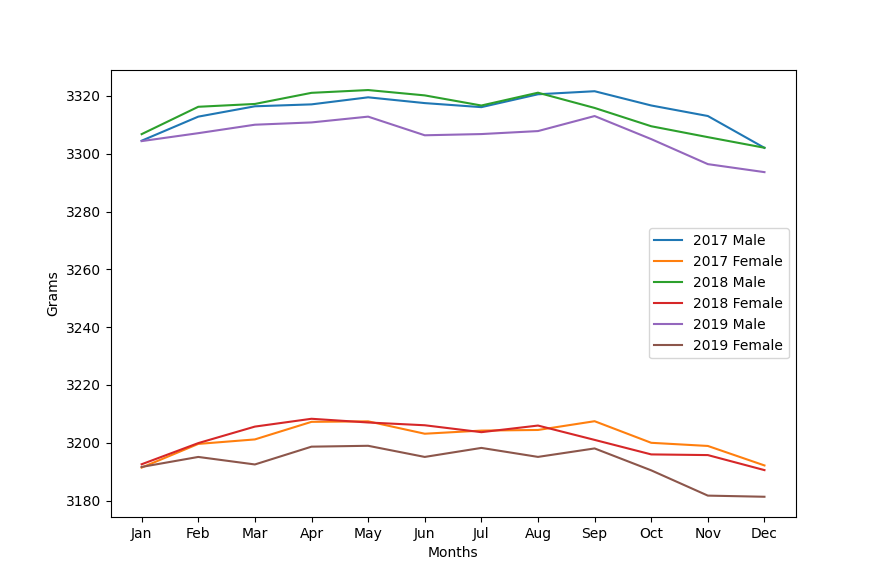
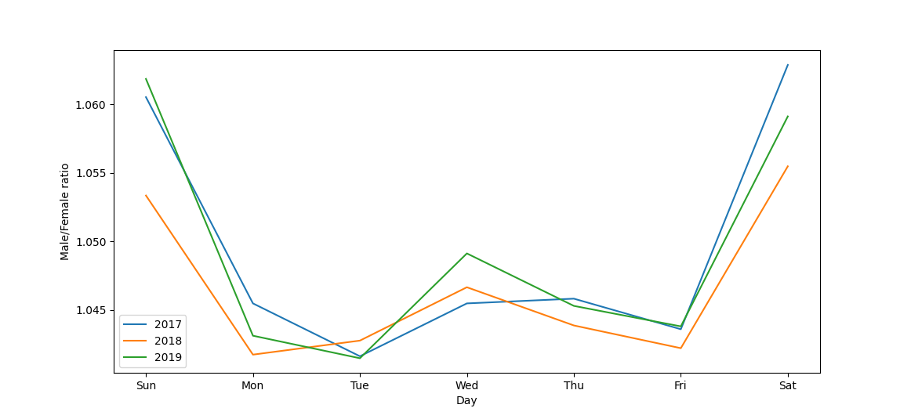

```{r setup, include=FALSE}
knitr::opts_chunk$set(echo = FALSE)
```
<h2>The proportion of boys to girls</h2>



<h2>The average birth weight in grams by gender</h2>



<h2>The proportion of boys to girls by day of birth</h2>

